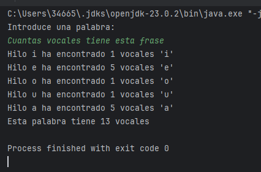

# Tarea_19_PSP

## 1. Clase Contador
- Tiene un atributo total que guarda el número total de vocales encontradas.
- El método incrementar(int cantidad) está marcado como synchronized, lo que significa que solo un hilo a la vez puede ejecutarlo.
- getTotal() devuelve el valor final del total de vocales.
  

## 2. Clase Hilos Vocales
- Hereda de Thread, por lo que representa un hilo independiente.
- Cada objeto de esta clase:
  - Guarda una vocal específica (a, e, i, o o u),
  - Guarda el texto completo,
  - Y tiene una referencia al contador total compartido.
- En el método run() :
  - Recorre el texto contando cuántas veces aparece su vocal.
  - Imprime el resultado individual del hilo.
  - Suma su resultado al contador total mediante contador.incrementar().

## 3. Clase Contar Vocales
- Es la clase principal.
- Pide al usuario una palabra.
- Crea un objeto ContadorTotal.
- Crea 5 hilos, uno por cada vocal.
- Los inicia con start() y cada hilo ejecuta su método run() simultáneamente.
- Usa join() para esperar a que todos los hilos terminen antes de continuar.
- Finalmente, imprime el total de vocales encontradas sumando todas las vocales.

## 4. Resultado 

